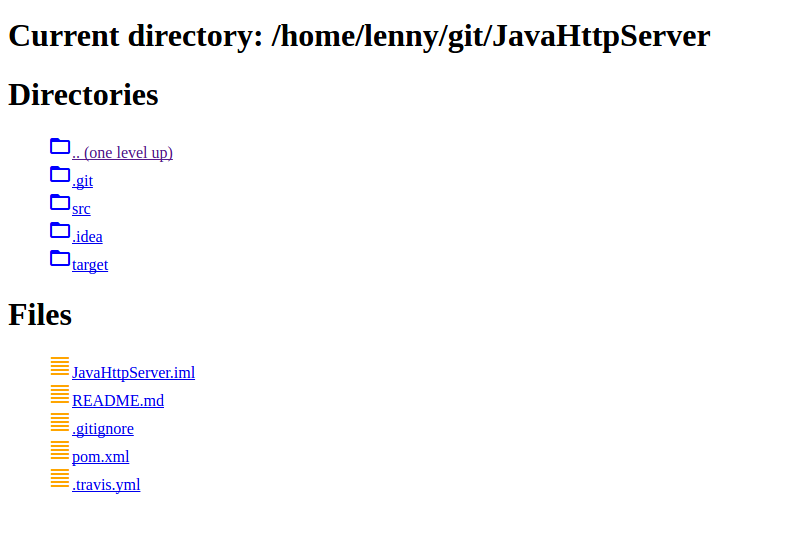
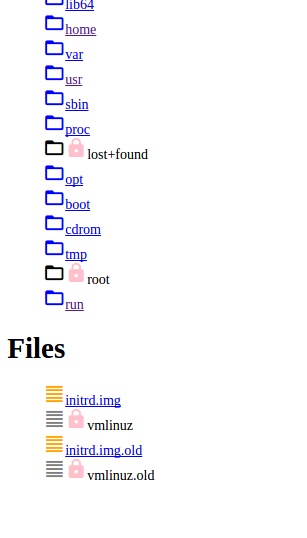

# JavaHttpServer
Simple java application that serves the host file system to a browser.

## Architecture

This is very straightforward.

1. Server
* encapsulates an HttpServer object, and provides the request handler implementation
2. FileSystemHtmlBuilder
* encapsulates the building of response html for filesystem objects.
* uses static html templates to generate the content into a simple html page
* html content includes an href link to _GET_ the item in the html (directory or file)
* functionally subdivided for unit testing

The main function creates a thread that runs the server object.

## Improvements

1. Get integration build working (see below for details)
2. Improve the logging
3. Mock the _HttpExchange_ object to test the content provided at this level
4. Serve file content differently depending what is known of the content on the server side.
5. 'Chunk' file content back to the client when content size exceeds some threshold.
6. Handle favicon requests...
7. Encrypt the content (https)
8. Turn it into a single page app, with a smarter client and json return from the server
9. etc...

## Building

The project has been developed using intellij, and includes the intellij project file, but is a maven project under the covers, so can be built with maven.

But... there is a problem, there is a testing dependency on Sauce Connect, which enables tunneling to SauceLabs for UI testing of the browser content. So prior to starting a build you will need to download and install Sauce Connect (see *https://wiki.saucelabs.com/display/DOCS/Setting+Up+Sauce+Connect*).

This will need to be started with the following command line:

```
$ sc -u LennyThompson -k b90ba3c3-2747-4524-8d2d-5c81b63d94ce
```
(or substiture your own Sauce Labs account details).

Once it says it is ready for testing, a build can be started.

```
mvn package
```

(If the build fails it is almost certainly due to Sauce Connect).

Building the maven package build will compile the java, run the unit and integration tests, and package a jar.

Note: This is far more likely to succeed on a linux machine than Windows, as the port settings on Windows for Sauce Connect are non-trivial.

See Testing below.

## Usage

Start the server, say locally, with a command line argument of the port the server should serve on (for instance):

```
$ java -jar target/JavaHttpServer-1.0-SNAPSHOT.jar PORT=5555
```

This should echo the port and current runtime directory (for instance).

```
$ Enter any charcter to terminate:
$ Starting new HttpServer on port: 5555 at root: /home/lenny/git/JavaHttpServer
```

Then browse to *localhost:5555*, which will show something like:



*Directories* are the subdirectories of the current directory, and *Files* are the files found.

- Clicking on a directory name will navigate to that directory.

- Clicking on a file will either display the file (if the browser supports the format) or download the file.

- Clicking on the *.. (one level up)* folder will take you one level up the directory heirarchy.

- Any directories or files that are read only will displayed as locked and wont have a link. For instance:



Only GET requests will be serviced by the code, all other requests (_PUT_, _POST_, _DELETE_) will result in a _405 Illegal method_ response.
## Testing

There is some unit testing of the underlying code - restricted to the code that transforms the file system content into html, and to testing that a known directory structure is generated correctly.

This uses junit, and should hold no surprises.

### Selenium and Sauce Labs

There are also 2 'unit' tests that test the actual browser content. These are more integration tests, as indicated in source file ```TestFileSystemE2E.java``` and rely on the technology mentioned above. Notably **Seleneium** backed by **Sauce Labs** and **Sauce Connect**.

The reason for adding this in was twofold:

- Provided an opportunity to learn a little UI testing with selenium

- Is probably the only realistic way to ensure the software actually works.

The problem is...

Tests run with selenium will work fine locally, but will not work within the context of a CI build (and travis is the target build environment) when a browser is spawned, so an additional service is needed to run the browser, and report the UI back to the build (tests), and this is what Sauce Labs does. The testing scenario is complicated by preferring to run the content server, ie the application, through localhost, against the currently built version. This then requires an extra piece of technology called Sauce Connect that provides a tunnelling proxy for Sauce Labs back to the local build machine. At least thats the theory.

This all works fine on a local physical linux machine, but I am unable to get this working on Windows (due to port issues), or travis (due to unknown issues). So the current status is that the code here will build locally, but will fail the integration build due to problems with travis and Sauce Connect that are currently unresolved (See improvement item 1).
